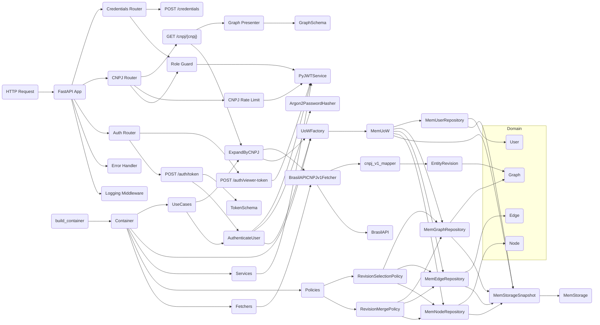

# OSINT Engine

[](https://github.com/geldois/osint-engine/actions)
[](https://github.com/geldois/osint-engine/releases)
[](https://www.python.org)
[](LICENSE)

Entity relationship graph engine that expands identifiers into a fully traceable network of connections sourced
exclusively from official public records.

## Overview

A **CNPJ** enters the engine as a root identifier. The engine queries official public records, constructs a typed
immutable graph, and returns it — ready to traverse. Each **Node** represents a real-world entity: a company, a person,
an address, a CNAE classification, a phone, or an email. Each **Edge** names the relationship between two nodes:
`company_has_member`, `person_owns_company`, `company_located_at`, and so on.

Every node and edge carries a stable, deterministic identity derived exclusively from its content. The same CNPJ
expanded on different machines at different times always produces the same graph with the same IDs — making the
structure idempotent by construction, not by convention.

## Architecture



## API

Every endpoint except `/auth/token` and `/auth/viewer-token` requires a Bearer token. Obtain one first, then use it
on every subsequent request.

### Authentication

```http
POST /auth/token
Content-Type: application/x-www-form-urlencoded

username=admin&password=<ADMIN_PASSWORD>
```

Returns an `ADMIN`-role token, 60-minute TTL (`ACCESS_TOKEN_EXPIRE_MINUTES`):

```json
{ "access_token": "<token>", "token_type": "bearer" }
```

```http
POST /auth/viewer-token
```

Issues a `VIEWER`-role token with no credential — 20-minute TTL by default (`VIEWER_TOKEN_EXPIRE_MINUTES`), same
response shape as above. Intended for public demo access: it can read `/cnpj/{cnpj}` but is rejected with `403` on
`/credentials`. See [ADR-0020](docs/adr/0020-role-guard-for-per-route-authorization.md).

### Graph expansion

```http
GET /cnpj/{cnpj}
Authorization: Bearer <token>
```

Returns a `GraphSchema` containing the root company, all connected entities, and all typed relationships. Available
to both `ADMIN` and `VIEWER` tokens. The current data source is [BrasilAPI](https://brasilapi.com.br) (see
[ADR-0005](docs/adr/0005-brasilapi-as-mvp-cnpj-data-source.md)).

### Rate limiting

| Endpoint | Limit | Keyed by |
| --- | --- | --- |
| `POST /auth/token` | 5 / 15 min | Client IP |
| `POST /auth/viewer-token` | 20 / min | Client IP |
| `GET /cnpj/{cnpj}` (`ADMIN`) | 60 / min | Shared `ADMIN` bucket |
| `GET /cnpj/{cnpj}` (`VIEWER`) | 10 / min | Shared `VIEWER` bucket |

A `429` response includes a `Retry-After` header (seconds) and is exposed cross-origin via
`Access-Control-Expose-Headers`. See [ADR-0021](docs/adr/0021-fastapi-throttle-over-slowapi-for-rate-limiting.md).

### Errors

Every response includes an `X-Correlation-ID` header for end-to-end request tracing. Error responses carry the same
correlation ID in the body alongside a machine-readable `type` field derived from the domain error hierarchy. A `401`
response always includes `WWW-Authenticate: Bearer` per RFC 6750; a `403` means a valid token lacks the required role;
a `429` means a rate limit was exceeded.

## Stack

- **Runtime:** Python 3.12, FastAPI, Uvicorn
- **Auth:** PyJWT (HS256 access tokens), argon2-cffi (Argon2id password hashing)
- **Rate limiting:** fastapi-throttle (in-memory)
- **HTTP client:** httpx2 (async)
- **Serialisation:** Pydantic v2 (discriminated unions for node and edge schemas)
- **Observability:** structlog (JSON in production, console in debug)
- **Tooling:** uv, Ruff, basedpyright (strict), Commitizen
- **Testing:** pytest, pytest-asyncio

## Design

### Content-addressable entity identity

Every entity — node, edge, and graph — derives its ID from its content via UUID5. The same input always produces the
same identifier, on any machine, at any time. Deduplication, idempotent upserts, and safe concurrent writes are
structural consequences, not implementation choices. Each entity type occupies its own UUID namespace so that a
`CompanyID` and a `PersonID` derived from identical payloads can never collide.

See [ADR-0003](docs/adr/0003-uuid5-over-uuid4-for-entity-identity.md).

### Fail-fast entity contracts

The entity base class uses `__init_subclass__` to validate every subclass at import time, not at instantiation.
A concrete entity missing a namespace or declaring an incompatible ID type raises immediately when the module is
loaded — before any test runs, before any instance is created. The domain is self-defending.

`__setattr__` and `__delattr__` raise `FrozenInstanceError` on every entity. Immutability is structural, not enforced
by convention.

See [ADR-0002](docs/adr/0002-manual-entity-base-class.md).

### Zero-cost type hierarchy

Each concrete entity declares its own `NewType` ID (`CompanyID`, `PersonID`, `GraphID`, …) as the generic parameter of
`Entity[IDType_co]`, where `IDType_co` is a covariant `TypeVar` bound to `UUID`. The type-checker enforces that a
`Node[CompanyID]` cannot be substituted for a `Node[PersonID]` — and that edge source and target ID types match their
declared constraints — with no runtime representation whatsoever. `NewType` is the identity function at runtime; the
distinction exists only in the type-checker's world.

See [ADR-0004](docs/adr/0004-idtype-co-typevar-for-covariant-id-typing.md).

### Temporal reconciliation via revisions

An entity captures *what* something is; *when* it was observed and how repeated observations reconcile are separate
concerns that must never leak into the content-addressable identity. Every fetched entity is wrapped in an immutable
`EntityRevision` that stamps `fetched_at` at the I/O boundary — the fetcher owns provenance, the mapper stays a pure
payload-to-graph function, and the `id` never absorbs a timestamp. When a re-fetch arrives for an entity already stored
under the same `id`, a pluggable `RevisionMergePolicy` reconciles the two by filled fields — the newest observation wins,
the older one fills nulls — and a `RevisionSelectionPolicy` chooses the current revision by newest `fetched_at`.
Repositories retain every revision keyed by `content_id`, so a leaner re-fetch can never silently overwrite a richer
prior observation.

See [ADR-0015](docs/adr/0015-fetcher-returns-entity-revision.md).

## Setup

```bash
git clone https://github.com/geldois/osint-engine.git
cd osint-engine
```

### Linux

1. Install [Docker Engine](https://docs.docker.com/engine/install/) and start the daemon.
2. Install [mise](https://mise.jdx.dev) and activate it in your shell (see [getting started](https://mise.jdx.dev/getting-started.html)).
3. Install the project toolchain and git hooks:

```bash
mise install
uv run pre-commit install
cp .env.example .env  # then set SECRET_KEY and ADMIN_PASSWORD
```

### Windows

1. Install [Docker Desktop](https://www.docker.com/products/docker-desktop/) with the WSL2 backend enabled.
2. Install [mise](https://mise.jdx.dev) via PowerShell and activate it in your shell (see [getting started](https://mise.jdx.dev/getting-started.html)).
3. Install the project toolchain and git hooks:

```powershell
mise install
uv run pre-commit install
copy .env.example .env  # then set SECRET_KEY and ADMIN_PASSWORD
```

> `--network host` in `.actrc` is Linux-only and has no effect on Docker Desktop. Internet access works via
Docker Desktop's default networking — the first run downloads dependencies from PyPI, subsequent runs use the uv cache.

### Run

```bash
uv run python -m osint_engine
```

### Test

```bash
uv run pytest --cov --cov-branch
```

### Local CI

```bash
act push
```
