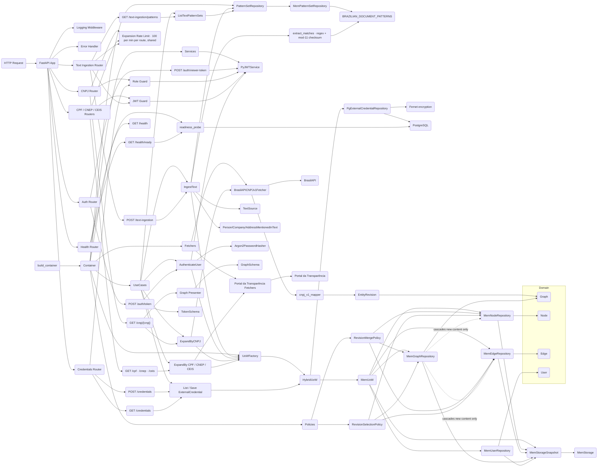

# OSINT Engine

[](https://github.com/geldois/osint-engine/actions)
[](https://github.com/geldois/osint-engine/releases)
[](https://www.python.org)
[](LICENSE)

Entity relationship graph engine that expands identifiers into a fully traceable network of connections sourced
exclusively from official public records.

**Live:** [osint-engine.angelitochagas.com/docs](https://osint-engine.angelitochagas.com/docs)

## Overview

A **CNPJ** enters the engine as a root identifier. The engine queries official public records, constructs a typed
immutable graph, and returns it — ready to traverse. Each **Node** represents a real-world entity: a company, a person,
an address, a CNAE classification, a phone, or an email. Each **Edge** names the relationship between two nodes:
`company_has_member`, `person_owns_company`, `company_located_at`, and so on.

Every node and edge carries a stable, deterministic identity derived exclusively from its content. The same CNPJ
expanded on different machines at different times always produces the same graph with the same IDs — making the
structure idempotent by construction, not by convention.

## Architecture


```mermaid
flowchart LR
    subgraph Domain
        Graph("Graph")
        Node("Node")
        Edge("Edge")
        User("User")
    end

    Client("HTTP Request") --> FastAPI("FastAPI App")
    FastAPI --> Logging("Logging Middleware")
    FastAPI --> ErrorHandler("Error Handler")
    FastAPI --> AuthRouter("Auth Router")
    FastAPI --> CNPJRouter("CNPJ Router")
    FastAPI --> ExpansionRouters("CPF / CNEP / CEIS Routers")
    FastAPI --> CredentialsRouter("Credentials Router")
    FastAPI --> HealthRouter("Health Router")
    FastAPI --> TextIngestionRouter("Text Ingestion Router")

    AuthRouter --> PostToken("POST /auth/token")
    AuthRouter --> PostViewerToken("POST /auth/viewer-token")
    CNPJRouter --> RoleGuard("Role Guard")
    CNPJRouter --> ExpansionRateLimit("Expansion Rate Limit · 100 per min per route, shared")
    CNPJRouter --> GetCNPJ("GET /cnpj/{cnpj}")
    ExpansionRouters --> JwtGuard("JWT Guard")
    ExpansionRouters --> ExpansionRateLimit
    ExpansionRouters --> GetExpansion("GET /cpf · /cnep · /ceis")
    CredentialsRouter --> RoleGuard
    CredentialsRouter --> PostCredential("POST /credentials")
    CredentialsRouter --> GetCredentials("GET /credentials")
    HealthRouter --> Liveness("GET /health")
    HealthRouter --> Readiness("GET /health/ready")
    TextIngestionRouter --> JwtGuard
    TextIngestionRouter --> ExpansionRateLimit
    TextIngestionRouter --> GetPatterns("GET /text-ingestion/patterns")
    TextIngestionRouter --> PostIngestion("POST /text-ingestion")

    Bootstrap("build_container") --> Container("Container")
    Container --> Fetchers("Fetchers")
    Container --> PatternSets("PatternSetRepository")
    Container --> Policies("Policies")
    Container --> Services("Services")
    Container --> UoWFactory("UoWFactory")
    Container --> UseCases("UseCases")
    Container --> ReadinessProbe("readiness_probe")

    UseCases --> AuthenticateUser("AuthenticateUser")
    UseCases --> ExpandByCNPJ("ExpandByCNPJ")
    UseCases --> ExpandByPortal("ExpandBy CPF / CNEP / CEIS")
    UseCases --> CredentialUseCases("List / Save ExternalCredential")
    UseCases --> IngestText("IngestText")
    UseCases --> ListPatternSets("ListTextPatternSets")
    Services --> PyJWTService("PyJWTService")
    Fetchers --> CNPJFetcher("BrasilAPICNPJv1Fetcher")
    Fetchers --> PortalFetchers("Portal da Transparência Fetchers")
    PatternSets --> MemPatternSets("MemPatternSetRepository")
    MemPatternSets --> DefaultPatterns("BRAZILIAN_DOCUMENT_PATTERNS")

    PostToken --> AuthenticateUser
    PostViewerToken --> PyJWTService
    GetCNPJ --> ExpandByCNPJ
    GetExpansion --> ExpandByPortal
    PostCredential --> CredentialUseCases
    GetCredentials --> CredentialUseCases
    GetPatterns --> ListPatternSets
    PostIngestion --> IngestText
    Readiness --> ReadinessProbe
    RoleGuard --> PyJWTService
    JwtGuard --> PyJWTService

    IngestText --> UoWFactory
    IngestText --> PatternSets
    IngestText --> ExtractMatches("extract_matches · regex + mod-11 checksum")
    ExtractMatches --> DefaultPatterns
    IngestText --> TextSourceNode("TextSource")
    IngestText --> MentionEdges("Person/Company/AddressMentionedInText")
    ListPatternSets --> PatternSets

    AuthenticateUser --> UoWFactory
    AuthenticateUser --> Argon2("Argon2PasswordHasher")
    AuthenticateUser --> PyJWTService

    ExpandByCNPJ --> UoWFactory
    ExpandByCNPJ --> CNPJFetcher
    ExpandByPortal --> UoWFactory
    ExpandByPortal --> PortalFetchers
    CNPJFetcher --> BrasilAPI("BrasilAPI")
    PortalFetchers --> PortalAPI("Portal da Transparência")
    CNPJFetcher --> Mapper("cnpj_v1_mapper")
    Mapper --> EntityRevision("EntityRevision")
    EntityRevision --> Graph

    UoWFactory --> HybridUoW("HybridUoW")
    HybridUoW --> MemUoW("MemUoW")
    HybridUoW --> PgCredentials("PgExternalCredentialRepository")
    CredentialUseCases --> HybridUoW
    PgCredentials --> Fernet("Fernet encryption")
    PgCredentials --> Postgres("PostgreSQL")
    ReadinessProbe --> Postgres
    MemUoW --> Snapshot("MemStorageSnapshot")
    MemUoW --> NodeRepo("MemNodeRepository")
    MemUoW --> EdgeRepo("MemEdgeRepository")
    MemUoW --> GraphRepo("MemGraphRepository")
    MemUoW --> UserRepo("MemUserRepository")

    Policies --> MergePolicy("RevisionMergePolicy")
    Policies --> SelectionPolicy("RevisionSelectionPolicy")
    MergePolicy --> NodeRepo
    MergePolicy --> EdgeRepo
    MergePolicy --> GraphRepo
    SelectionPolicy --> NodeRepo
    SelectionPolicy --> EdgeRepo
    SelectionPolicy --> GraphRepo

    NodeRepo --> Snapshot
    EdgeRepo --> Snapshot
    GraphRepo --> Snapshot
    UserRepo --> Snapshot
    Snapshot --> MemStorage("MemStorage")

    NodeRepo --> Node
    EdgeRepo --> Edge
    GraphRepo --> Graph
    UserRepo --> User
    GraphRepo -.cascades new content only.-> NodeRepo
    GraphRepo -.cascades new content only.-> EdgeRepo

    GetCNPJ --> GraphPresenter("Graph Presenter")
    GraphPresenter --> GraphSchema("GraphSchema")
    PostToken --> TokenSchema("TokenSchema")
```

## API

Every endpoint except `/auth/token` and `/auth/viewer-token` requires a Bearer token. Obtain one first, then use it on
every subsequent request.

### Authentication

```http
POST /auth/token
Content-Type: application/x-www-form-urlencoded

username=admin&password=<ADMIN_PASSWORD>
```

Returns an `ADMIN`-role token, 60-minute TTL (`ACCESS_TOKEN_EXPIRE_MINUTES`):

```json
{ "access_token": "<token>", "token_type": "bearer" }
```

```http
POST /auth/viewer-token
```

Issues a `VIEWER`-role token with no credential — 20-minute TTL by default (`VIEWER_TOKEN_EXPIRE_MINUTES`), same
response shape as above. Intended for public demo access: it can read `/cnpj/{cnpj}` but is rejected with `403` on
`/credentials`. See `docs/architecture/interface.md`.

### Graph expansion

```http
GET /cnpj/{cnpj}
Authorization: Bearer <token>
```

Returns a `GraphSchema` containing the root company, all connected entities, and all typed relationships. Available to
both `ADMIN` and `VIEWER` tokens. The current data source is [BrasilAPI](https://brasilapi.com.br) (see
`docs/architecture/infrastructure.md`).

### Text ingestion

```http
GET /text-ingestion/patterns
Authorization: Bearer <token>
```

Lists the available pattern sets and which fields each one covers, without exposing the underlying compiled regex.

```http
POST /text-ingestion
Authorization: Bearer <token>
Content-Type: application/json

{ "text": "...", "pattern_set_id": "brazilian_documents_v1" }
```

Extracts CPF/CNPJ/CEP-and-number from free text via regex plus a mod-11 checksum, never calling any external API. Every
match is checked against what the graph already knows by deterministic id: an existing entity is only linked, a new one
becomes a minimal stub (identity field only, nothing invented). The response is a `GraphSchema` rooted at a `TextSource`
node, with a `PersonMentionedInText`/`CompanyMentionedInText`/`AddressMentionedInText` edge per match. Returns `422` if
no pattern in the set matched anything, `404` for an unknown `pattern_set_id`. See `docs/architecture/application.md`.

### Health

```http
GET /health
```

Liveness — always `200 {"status": "ok"}` while the process is up, touching no dependency. Both health endpoints are
unauthenticated and unthrottled so a hosting platform (Render) can poll them freely.

```http
GET /health/ready
```

Readiness — `200 {"status": "ready"}` when Postgres answers a `SELECT 1`, `503 {"status": "not_ready"}` otherwise.

### Rate limiting

| Endpoint                       | Limit      | Keyed by                |
| ------------------------------ | ---------- | ----------------------- |
| `POST /auth/token`             | 5 / 15 min | Client IP               |
| `POST /auth/viewer-token`      | 20 / min   | Client IP               |
| `GET /cnpj/{cnpj}`             | 100 / min  | Shared per-route bucket |
| `GET /cpf/{cpf}`               | 100 / min  | Shared per-route bucket |
| `GET /cnep/{cpf_or_cnpj}`      | 100 / min  | Shared per-route bucket |
| `GET /ceis/{cpf_or_cnpj}`      | 100 / min  | Shared per-route bucket |
| `GET /text-ingestion/patterns` | 100 / min  | Shared per-route bucket |
| `POST /text-ingestion`         | 100 / min  | Shared per-route bucket |

A `429` response includes a `Retry-After` header (seconds) and is exposed cross-origin via
`Access-Control-Expose-Headers`. See `docs/architecture/interface.md`. Each expansion route has one global bucket shared
across all callers — a fixed key, not per-IP or per-role — so the combined outbound traffic every visitor generates
together is capped against the upstream API's per-minute quota, since every request proxies through this deployment's
own IP/token. The health endpoints are unthrottled.

### Errors

Every response includes an `X-Correlation-ID` header for end-to-end request tracing. Error responses carry the same
correlation ID in the body alongside a machine-readable `type` field derived from the domain error hierarchy. A `401`
response always includes `WWW-Authenticate: Bearer` per RFC 6750; a `403` means a valid token lacks the required role; a
`429` means a rate limit was exceeded.

## Stack

- **Runtime:** Python 3.12, FastAPI, Uvicorn
- **CLI:** Typer (`osint-engine serve` / `osint-engine migrate up|down`)
- **Auth:** PyJWT (HS256 access tokens), argon2-cffi (Argon2id password hashing)
- **Persistence:** PostgreSQL via asyncpg + aiosql (external credentials), golang-migrate (schema migrations), in-memory
  snapshot store (graph/user data)
- **Encryption:** cryptography (Fernet, application-layer encryption of stored API keys)
- **Rate limiting:** fastapi-throttle (in-memory)
- **HTTP client:** httpx2 (async)
- **Serialisation:** Pydantic v2 (discriminated unions for node and edge schemas)
- **Observability:** structlog (JSON in production, console in debug)
- **Tooling:** uv, Ruff, basedpyright (strict), import-linter, cosmic-ray
- **Testing:** pytest, pytest-asyncio, testcontainers

## Design

### Content-addressable entity identity

Every entity — node, edge, and graph — derives its ID from its content via UUID5. The same input always produces the
same identifier, on any machine, at any time. Deduplication, idempotent upserts, and safe concurrent writes are
structural consequences, not implementation choices. Each entity type occupies its own UUID namespace so that a
`CompanyID` and a `PersonID` derived from identical payloads can never collide.

See `docs/architecture/domain.md`.

### Fail-fast entity contracts

The entity base class uses `__init_subclass__` to validate every subclass at import time, not at instantiation. A
concrete entity missing a namespace or declaring an incompatible ID type raises immediately when the module is loaded —
before any test runs, before any instance is created. The domain is self-defending.

`__setattr__` and `__delattr__` raise `FrozenInstanceError` on every entity. Immutability is structural, not enforced by
convention.

See `docs/architecture/domain.md`.

### Zero-cost type hierarchy

Each concrete entity declares its own `NewType` ID (`CompanyID`, `PersonID`, `GraphID`, …) as the generic parameter of
`Entity[IDType_co]`, where `IDType_co` is a covariant `TypeVar` bound to `UUID`. The type-checker enforces that a
`Node[CompanyID]` cannot be substituted for a `Node[PersonID]` — and that edge source and target ID types match their
declared constraints — with no runtime representation whatsoever. `NewType` is the identity function at runtime; the
distinction exists only in the type-checker's world.

See `docs/architecture/domain.md`.

### Temporal reconciliation via revisions

An entity captures *what* something is; *when* it was observed and how repeated observations reconcile are separate
concerns that must never leak into the content-addressable identity. Every fetched entity is wrapped in an immutable
`EntityRevision` that stamps `fetched_at` at the I/O boundary — the fetcher owns provenance, the mapper stays a pure
payload-to-graph function, and the `id` never absorbs a timestamp. When a re-fetch arrives for an entity already stored
under the same `id`, a pluggable `RevisionMergePolicy` reconciles the two by filled fields — the newest observation
wins, the older one fills nulls — and a `RevisionSelectionPolicy` chooses the current revision by newest `fetched_at`.
Repositories retain every revision keyed by `content_id`, so a leaner re-fetch can never silently overwrite a richer
prior observation.

See `docs/architecture/application.md`.

## Setup

```bash
git clone https://github.com/geldois/osint-engine.git
cd osint-engine
```

### Linux

1. Install [Docker Engine](https://docs.docker.com/engine/install/) and start the daemon.
2. Install [mise](https://mise.jdx.dev) and activate it in your shell (see
   [getting started](https://mise.jdx.dev/getting-started.html)).
3. Install the project toolchain and git hooks:

```bash
mise install
uv run python -m scripts hooks install
cp .env.example .env  # then set SECRET_KEY, ADMIN_PASSWORD, DATABASE_URL and EXTERNAL_CREDENTIAL_ENCRYPTION_KEY
```

### Windows

1. Install [Docker Desktop](https://www.docker.com/products/docker-desktop/) with the WSL2 backend enabled.
2. Install [mise](https://mise.jdx.dev) via PowerShell and activate it in your shell (see
   [getting started](https://mise.jdx.dev/getting-started.html)).
3. Install the project toolchain and git hooks:

```powershell
mise install
uv run python -m scripts hooks install
copy .env.example .env  # then set SECRET_KEY, ADMIN_PASSWORD, DATABASE_URL and EXTERNAL_CREDENTIAL_ENCRYPTION_KEY
```

> The git hooks and the `uv run python -m scripts …` dev runner call `uv` directly, so `mise` must be active on the
> `PATH` of the shell you commit from — `mise` provides the pinned `uv`, `dprint`, `shellcheck` and `shfmt`. If `uv`
> isn't found, the hook prints how to fix it (activate mise, or `git commit --no-verify` to bypass once). No editor or
> Claude Code is required: the quality gates run entirely from these git hooks and CI, identically for every
> contributor, and there is no `pre-push` — pushing is never blocked.

> `--network host` in `.actrc` is Linux-only and has no effect on Docker Desktop. Internet access works via Docker
> Desktop's default networking — the first run downloads dependencies from PyPI, subsequent runs use the uv cache.

### Run

`osint-engine migrate` needs the `migrate` CLI on `PATH` (installed by `mise install`, pinned to the same version the
Dockerfile uses) and a running Postgres reachable at `DATABASE_URL` — unlike the test suite, `serve`/`migrate` don't
spin one up for you. `docker-compose.yml` starts a persistent local Postgres matching `.env.example`'s credentials, and
`osint-engine wait-db` blocks until it actually accepts connections (Postgres reports the container as "started" well
before it's ready to accept connections — polling avoids a race against it):

```bash
docker compose up -d
uv run osint-engine wait-db
uv run osint-engine migrate up
uv run osint-engine serve
```

The production image runs this sequence: its entrypoint chains `wait-db`, `migrate up`, then `serve`, so a container
deploy (Render) needs no manual migration step — the commands above are only for running against a local Postgres
outside the container.

### Test

`tests/**/responses/` (golden HTTP fixtures for the BrasilAPI/Portal da Transparência source tests) is untracked and
regenerated on demand, not committed — run this once before testing, and again whenever the fixtures need refreshing:

```bash
uv run python -m scripts fixtures refresh
```

Portal da Transparência's fixtures require a real, working `PORTAL_TRANSPARENCIA_API_KEY` in `.env` — request one at
<https://api.portaldatransparencia.gov.br/>.

```bash
uv run pytest --cov --cov-branch
```

`tests/test_infrastructure/test_persistence/test_pg/` spins up a real Postgres via `testcontainers`, pulling the
`postgres:18` and `testcontainers/ryuk:0.8.1` images from Docker Hub on first run (cached locally afterward). If pulls
hang or time out, your DNS resolver may not be resolving Docker Hub reliably — point the Docker daemon at a known-good
resolver in `/etc/docker/daemon.json`:

```json
{ "dns": ["1.1.1.1", "8.8.8.8"] }
```

then `sudo systemctl restart docker` and re-run the pulls.

### Local CI

```bash
act push
```
